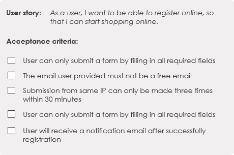

## Acceptance Criteria

`Acceptance criteria` (AC) are the conditions that a software product must meet to be accepted by a user, a customer, or other system. They are unique for each user story and define the feature behavior from the end-user’s perspective. Well-written acceptance criteria help avoid unexpected results in the end of a development stage and ensure that all stakeholders and users are satisfied with what they get

