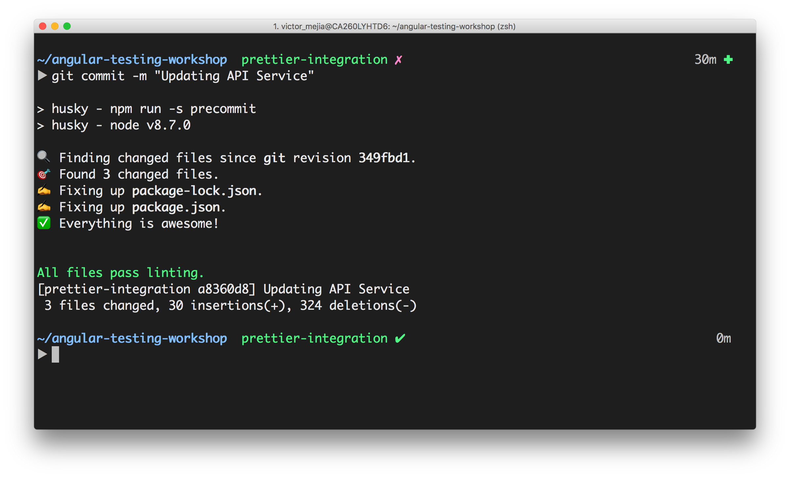

## Code formatting


**Resources**

- ["Prettier"](https://prettier.io/)

`Prettier` is an opinionated code formatter with support for:

- JavaScript (including experimental features)
- JSX
- Angular
- Vue
- Flow
- TypeScript
- CSS, Less, and SCSS
- HTML
- JSON
- GraphQL
- Markdown, including GFM and MDX
- YAML

### Install and Configure Prettier

```npm
npm install prettier -D
```

Next, `Prettier` has default configurations, however it's possible to set up a configuration file. This has the added benefit that regardless of what editor your team members use, they will all reference the same configuration file. Create a `.prettierrc` file

```npm
{
  “printWidth”: 120,
  “singleQuote”: true,
  “useTabs”: false,
  “tabWidth”: 2,
  “semi”: true,
  “bracketSpacing”: true
}
```

Next, Install the extension for your editor.

### Configure pre-commit hooks

Pre-commit hooks are a great way to run certain checks to ensure clean code. This can be used to format staged files if for some reason they weren’t automatically formatted during editing. `husky` can be used to easily configure git hooks to prevent bad commits. We will use this along with `pretty-quick` to run `Prettier` on our changed files.

Install these packages.

```npm
npm install pretty-quick husky  -D
```

Add this to your `package.json`:

```npm
"husky": {
    "hooks": {
      "pre-commit": "pretty-quick --staged"
    }
}
```

### Result


