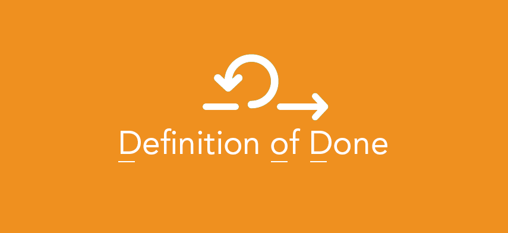

## Definition of Done

**Resources**

- ["Find Your Definition of Done"](https://plan.io/blog/definition-of-done/#what-is-a-definition-of-done-dod)

`Definition of Done` is a list of criteria that has to be met before any work can be considered done. Failure to meet any one of these conditions means the work is not complete

### Who Defines Definition of Done?

Scrum team defines the definition of done. They are the ones who will be accountable to meet this definition, so it’s essential that the team creates it and agrees to it. In some cases, the definition of done can be at an organization level or at a product level but even in such cases, the scrum team would need to agree to it and make modifications as required to fit their product increment needs.

### When do we create the Definition of Done?

The team would need to use this definition in the first sprint when they would mark the first product increment as done. That means the definition of done should create before the first sprint or latest within the first sprint itself.

The automated tests have been executed and no regression or blocker/critical, major issues have been raised
The User Story is moved to the status <Ready for Deployment> on the Project Board (status means Backbase development finished)

### Example for User stories

| #   | Task                                                      |
| --- | --------------------------------------------------------- |
| 1   | Acceptance criteria for each issue met                    |
| 2   | Code review has been completed                            |
| 3   | Unit tests are written and passed                               |
| 4   | Functional tests passed                                   |
| 5   | Non-functional requirements met                           |
| 6   | Build has been made and deployed on a testing environment |
| 7   | Product owner accepts the User Story                      |
| 8   | The relevant documentation is updated                                        |
| 9   | Accessibilty    |

### Example for Sprint

| #   | Task                                                      |
| --- | --------------------------------------------------------- |
| 1   | The Sprint Backlog is prioritised                    |
| 2   | All User Stories meet Definition of Ready for User Stories                            |
| 3   | API contract is ready for the user stories taken in the Sprint                               |
| 4   | Mock data is provided for stories taken in the Sprint                                   |