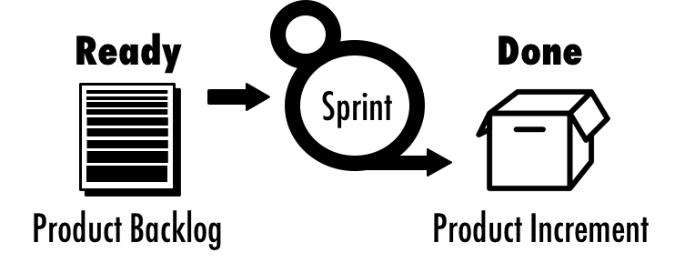
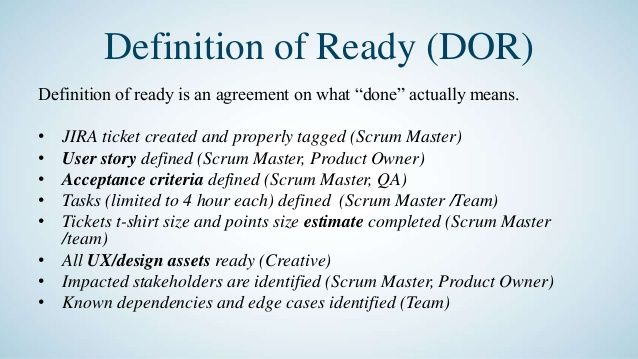

## Definition of Ready

`Definition of Done` is a set of agreements that tells you when something is ready to begin

A `definition of ready` deals with the user story, wherein the user story is ready to be taken into a sprint. It doesn’t need to be “100 % defined” covering all the acceptance criteria. However, it should be “ready enough” only when the team is confident that they can successfully deliver the user story.

It will help in saving ample time if each user story meets the `definition of ready` before the sprint planning meeting. But it is also fine and acceptable to work on the user story during the sprint planning meeting and bring it to the ‘Ready’ status.

### How to create a Definition of Ready

A good user story will have the following attributes. Those are called as `INVEST` Matrix in the scrum world.

`Independent` – The user story must be independent of each other 

`Negotiable` – Ability to be negotiable and not a contract for a specific feature

`Valuable` – Contains a definite value

`Estimable` – The user stories need to be estimated

`Small` – The user stories must not be large but broken down into small pieces

`Testable` – The user stories must be tested so that they have to satisfy these attributes as well.

They can be explained as follows:

- The user story must be in a particular User Story format.
- The acceptance criteria must be understandable by the team
- The product owner and his/her team must make the user story estimable
- The user stories must be demonstrable before the stakeholders
- The Product Owner and the team must understand the performance criteria.

### Example

| #   | Task                                                      |
| --- | --------------------------------------------------------- |
| 1   | Jira ticket created and properly taged (Scrum Master)     |
| 2   | User story defined (Scrum Master, PO)                     |
| 3   | Acceptance Criteria defined (Scrum Master, QA)            |
| 4   | Tasks Defined (Scrum Master, Team)                        |
| 5   | Tickets t-shirt size and points size estimate completed       (Scrum Master, Team)                                              |
| 6   | All UI/UX designs ready                                   |
| 7   | Impacted stakeholders are identified (Scrum Master, PO)   |
| 8   | Known dependencies and edge cases identified (Team)       |

  
