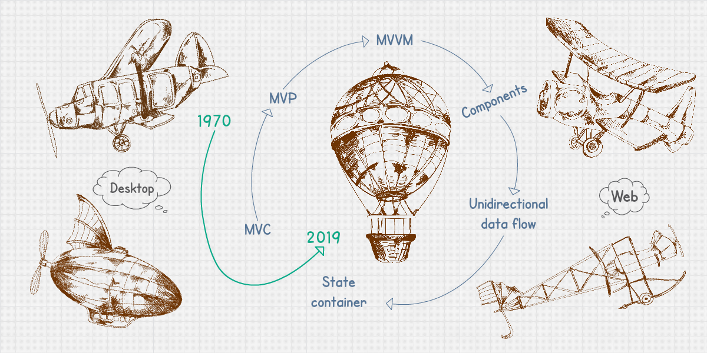

## Front-end Architect role

A `Front-end Architect` creates and documents architectures for front-end applications. He is in charge of reviewing the implementation of applications following code standards and style guides. She sets the workflows for her teams that guarantee everyone uses the same tooling; having scalability, maintainability, and robustness as her goals.

### Responsibilities

- Lead front-end code reviews with her teammates
- Run reviews to guarantee the structure and design of the applications follow the standards and guidelines.
- Solve complex CSS and HTML compatibility issues in legacy browsers
- Review the Web Content Accessibility Guidelines (WCAG) and Section 508 are being satisfied in the project.
- Optimize logic-less templates using Front-end Template Engines.
- Optimize JavaScript implementations
- Generate documentation about UI architecture, interactions and behaviors with REST APIs or any other mechanism to process data (GraphQL, etc.).
- Document and assist in defining the functional and technical requirements of different applications.
- Evaluate new frameworks and tools that can be integrated into the existing applications without breaking previous implementations.
- Implement front-end development workflows: building systems, dependency management, quality checkers (linting).
- Create pattern libraries and style guides according to the project’s requirements.
- Run performance tests and solve issues as they appear.
- Constantly develop yourself and the team in technology advancements, research new approaches, tools and best practices in the software architecture and design space.
- Suggest improvements to our technology stack to optimize it for strategic growth.