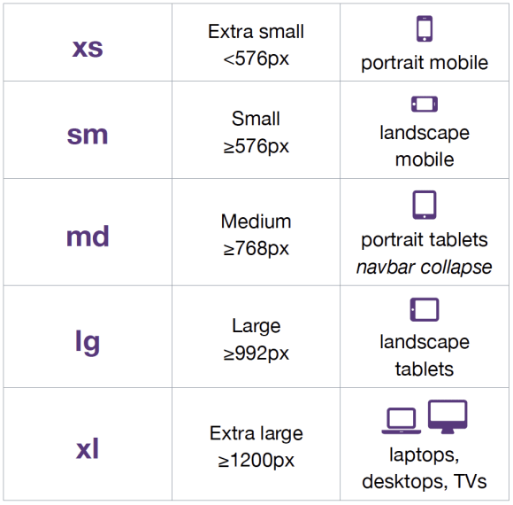

# Front End Architecture Document

## Table of Content

- [Introduction](#Introduction)
- [Browser Support](./Browser_Support/browser_support.md)
- [Code Formatting](./Code_Formatting/code_formatting.md)
- [Definition of Done](./Definition_of_Done/definition_of_done.md)
- [Architecture decision record](./ADR/adr.md)

## Introduction

In order to maintain high quality of delivery and prevent technical debt from being created, we had to agree to a series of guidelines and good practices of how to plan, structure and write applications in Angular

## Mobile/Tablet Support

- List of supported devices.
- Required Platforms
  - IOS
  - Android
- Responsive design(breakpoints)
  

## Style Guides

## Accessibility

## Internationalization (i18n) and Translations

## Best Practices

## Testing

## Application Deployment

## Styling and Design Systems

## Search Engine Optimization (SEO)

## Microfrontends vs. Monoliths

## LONGLIST

- State Management and Sync Strategies
  - Pushing Data from the Server
  - REST vs. GraphQL
  - Loading and Error States
  - Caching Requests - Authorization/Authentication
- Bundle Management
  - Code Splitting
  - Tree-Shaking
  - Lazy-loading
- Dependency Management
  - node_modules
  - npm / Yarn
  - Build your own registry
- Application Deployment
  - Build Processes
  - Continuous Integration / Continuous Deployment
  - Docker / Kubernetes
  - Hosting and Content Delivery Networks
- Application Monitoring
  - End user monitoring
  - Synthetic monitoring
- Testing
- Styling and Design Systems
  - CSS Methodologies
  - CSS-in-JS
- Linting
- Search Engine Optimization (SEO)
- Accessibility
- Localization
- Client-Side Routing
- Font Loading and Rendering
- Image Optimization
- Performance
  - Inlining CSS
  - RAIL
  - PRPL
  - Layout Performance
  - Runtime Performance
  - Auditing
- Microfrontends vs. Monoliths
- Backends for Front End
  - Custom back-end solutions
  - Out of box solutions
  - Google Firebase
  - Firebase Functions
- Server-Side Rendering vs. Static Site Generation
- WebAssembly
- Type Systems
- Monitoring and Alerting
- Design Patterns
- Documentation
  - Platform Architecture
  - Sequence Diagrams/User Flows
  - Developer Workflow
  - Performance Budgets
  - Testing Strategy
  - Runbooks
  - Compliance Considerations
  - SOX
  - GDPR
  - WCAG 2.0
  - PCI
  - HIPAA
  - etc.
- Repo creation
  - README.md
  - Local Setup
  - Develop Against Different Environments
  - Run Tests
  - CONTRIBUTOR.md
  - Conventional Commits
  - Code Review Process
  - Library Release Process
- Templates and tooling
  - Bootstrapping new projects
  - Updating legacy code (Codemods)
