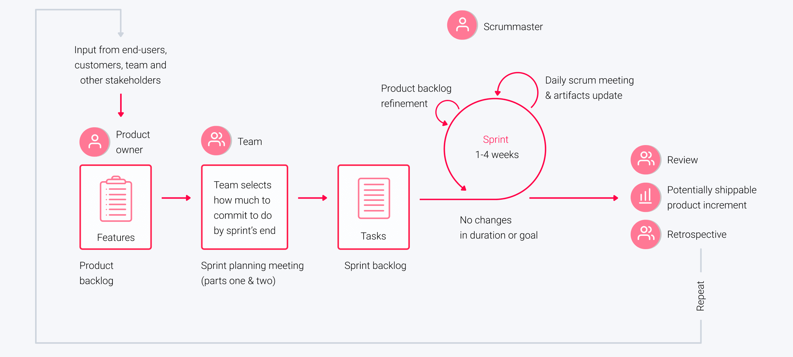

## Scrum Events

**Resources**

- ["Product Backlog Refinement"](https://medium.com/the-value-maximizers/scrum-events-product-backlog-refinement-db2248cf36fc)
- ["Sprint Planning"](https://medium.com/the-value-maximizers/scrum-events-sprint-planning-dff9d4937b04)
- ["Daily Standup"](https://medium.com/the-value-maximizers/scrum-events-daily-scrum-e772a5fa176d)
- ["Sprint Review"](https://medium.com/the-value-maximizers/scrum-events-sprint-review-a40f79afe764)
- ["Sprint Retrospective"](https://medium.com/the-value-maximizers/scrum-events-sprint-retrospective-b59eb768edf4)

There are five types of Scrum meetings held in regular intervals:

- Product backlog refinement
- Sprint planning
- Daily standup
- Sprint review
- Sprint retrospective

### Product Backlog Refinement

`Product Backlog refinement` is the act of adding detail, estimates, and order to items in the Product Backlog.

- `Space`: online meeting (Teams), all people need to be there
- `Time`: 1-2 hours (2 week sprint), occurs between sprints, officially can be 10% of sprint time
- `Eventfulness` 
    - Evaluate a story for clarity, size and feasibility
    - Learn what’s coming up in the next sprint
    - Express concerns early in the process
    - Identify risks
    - Slicing bigger items into smaller items
    - Make sprint planning move quicker
- `Product`: As a result of this meeting we need to have ordered list of tickets that satisfy `Definition of Ready` and have estimations. 
- `Style`: 
    - Generating ideas
    - Building consensus
    - Finding intersection points
    - Linking
    - Summary

### Sprint planning

Sprint Planning is the scrum ceremony designed to make sure the team is prepared to get the right things done every sprint

- `Space`: online meeting (Teams), PO, SM, Team
- `Time`: 1-4 hours (2 week sprint), happens at the beginning of a new sprint
- `Eventfulness` 
    - Review the prioritized Product Backlog
    - Define sprint goal that can be demonstrated at the end of a sprint
    - Be sure to keep in mind any time off, vacations, holidays to accurately reflect the amount of work that can be accomplished
- `Product`: As a result of this meeting we need to have ready `Sprint Backlog`
- `Style`: 
    - Acceptance
    - Building consensus
    - Stacking
    - Tracking

### Daily standup

The purpose of the `Daily Scrum` Event is to inspect progress made towards the `Sprint Goal` and progress made in the `Sprint Backlog`, in order to adapt the plan for the rest of the `Sprint`.

- `Space`: online meeting (Teams), PO, SM, Team
- `Time`: 15-minute, held every day of the Sprint
- `Eventfulness` 
    - Improve the Development Team’s level of knowledge
    - The Development Team makes a plan for the next 24 hours
- `Product`: The goal of this event is optimize team collaboration and performance.
- `Style`: 
    - Stacking 
    - Tracking

### Sprint review

- `Space`: online meeting (Teams)
- `Time`: 1-2 hours, occurs between sprints
- `Eventfulness` 
    - todo
- `Product`: 
- `Style`: 
    - todo 

### Sprint retrospective

- `Space`: online meeting (Teams)
- `Time`: 1-2 hours, occurs between sprints
- `Eventfulness` 
    - todo
- `Product`: 
- `Style`: 
